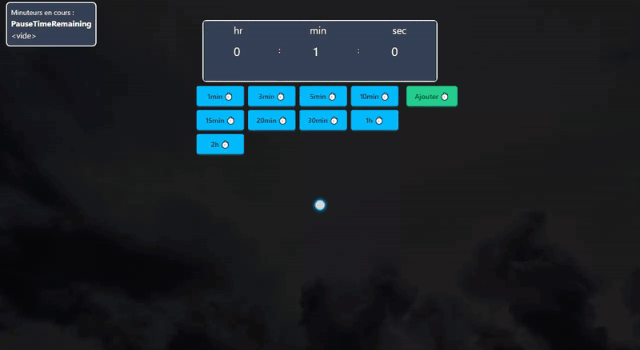

# Projet de gestion de Multi-Timers - SPA React

## Aperçu du Projet

J'ai récemment développé une application monopage (SPA) complète en React dédiée à la création de multi-timers. Cette application utilise une architecture moderne pour offrir une expérience utilisateur fluide et intuitive.

Version vidéo : [docs/demo-timers.mp4](docs/demo-timers.mp4)

## Technologies Utilisées

- **React** : Le cœur de l'application, permettant une interface utilisateur dynamique et réactive.
- **Zustand** : Pour la gestion de l'état global, facilitant le partage de données à travers les composants sans prop drilling.
- **Tailwind CSS (v4)** : Pour le styling, avec une palette et une typographie propres au projet déclarées dans `@theme`.
- **Formik** : Pour la gestion des formulaires, simplifiant la validation et la soumission des données.
- **Yup** : Pour la validation des formulaires, assurant que les données saisies par les utilisateurs sont correctes et cohérentes.
- **Claude Terminal / Claude Design** : Itération UI assistée par IA (variantes générées puis retravaillées), revue de code systématique avant merge.

## Fonctionnalités Clés

- **Interface inspirée d'un minuteur de cuisine** : Chaque minuteur a son cadran gradué, dont le disque jaune rétrécit à mesure que le temps passe. Gris en pause, rouge une fois terminé.
- **Gestion des Timers** : Affichage des Timers avec la possibilité de les mettre en pause et de les supprimer. Possibilité de manager les Timers : Mettre tous les Timers en Pause, Suppression des Timers.
- **Formulaires Robustes** : Utilisation de Formik et Yup pour le formulaire de saisie des Hr:Min:Sec robustes et validés.
- **Gestion du temps** : Chaque Timer utilise son propre setInterval() pour gérer l'affichage.

## Objectifs et Défis

L'objectif principal de ce projet était de créer une application de gestion de Timers moderne et performante, offrant une expérience utilisateur fluide et intuitive. Les défis incluaient la gestion de l'état global avec Zustand, l'optimisation des performances des Timers (setInterval() et clearInterval()), et l'intégration de formulaire robustes avec Formik et Yup.

## Conclusion

Ce projet a été une excellente opportunité pour approfondir mes compétences en React et explorer des technologies modernes pour la création d'applications web. Je suis fier du résultat final et je suis impatient de continuer à améliorer et à étendre les fonctionnalités de l'application.

## Après téléchargement du projet :

Lançer les commandes : npm install
[puis] npm run dev
